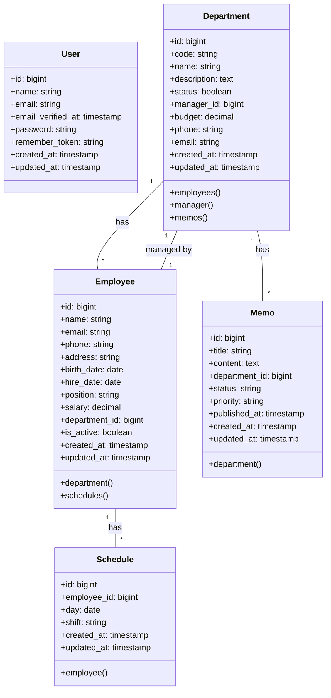

# 📊 Diagramas de Base de Datos - Webgestor

## 📋 Diagrama de Clases



## 🔄 Diagrama Entidad-Relación

```mermaid
erDiagram
    USERS {
        bigint id PK
        string name
        string email
        timestamp email_verified_at
        string password
        string remember_token
        timestamp created_at
        timestamp updated_at
    }

    DEPARTMENTS {
        bigint id PK
        string code
        string name
        text description
        boolean status
        bigint manager_id FK
        decimal budget
        string phone
        string email
        timestamp created_at
        timestamp updated_at
    }

    EMPLOYEES {
        bigint id PK
        string name
        string email
        string phone
        string address
        date birth_date
        date hire_date
        string position
        decimal salary
        bigint department_id FK
        boolean is_active
        timestamp created_at
        timestamp updated_at
    }

    SCHEDULES {
        bigint id PK
        bigint employee_id FK
        date day
        string shift
        timestamp created_at
        timestamp updated_at
    }

    MEMOS {
        bigint id PK
        string title
        text content
        bigint department_id FK
        string status
        string priority
        timestamp published_at
        timestamp created_at
        timestamp updated_at
    }

    DEPARTMENTS ||--o{ EMPLOYEES : "has"
    DEPARTMENTS ||--o{ MEMOS : "has"
    EMPLOYEES ||--o{ SCHEDULES : "has"
    DEPARTMENTS ||--|| EMPLOYEES : "managed by"
